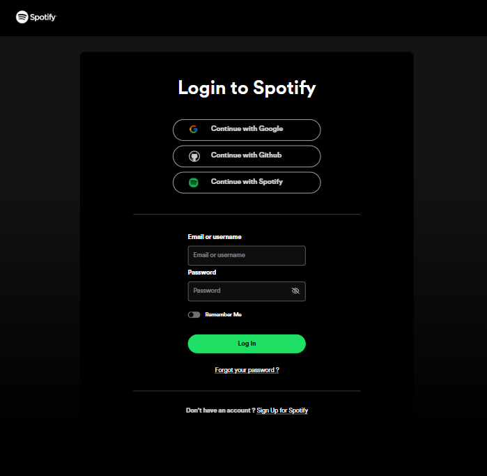
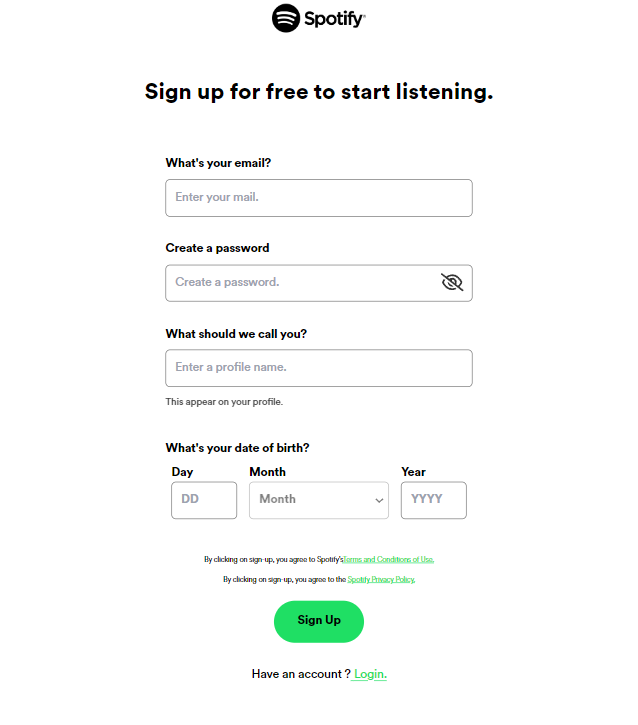
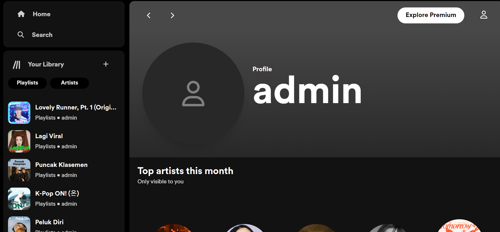
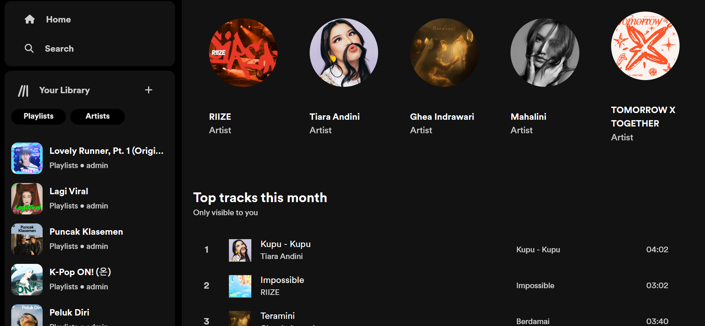
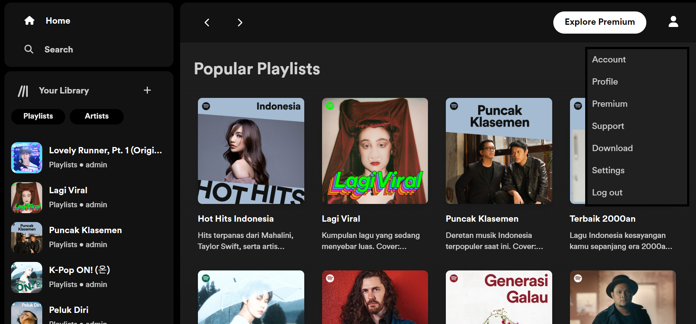
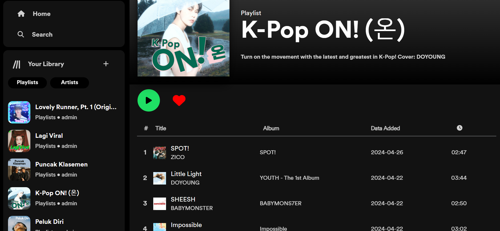
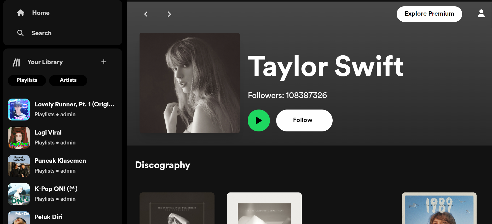
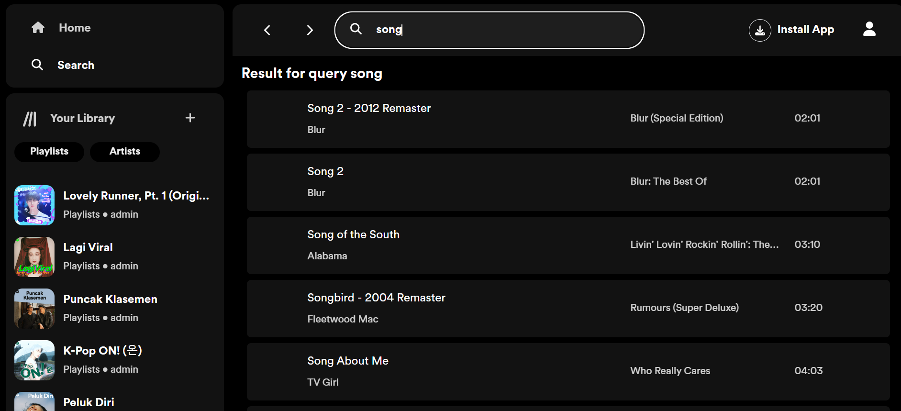
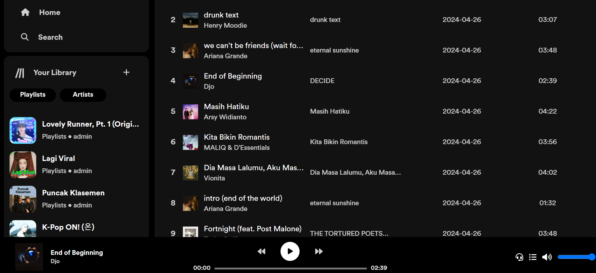

# Spotify Clone

<!-- readme header  -->
<div align="center">
  <p align="left">
    <br />
    <a href="https://github.com/ricotandrio/clone-spotify/blob/master/README.md"><strong>Explore the docs »</strong></a>
    <br />
    <br />
    <a href="https://clone-spotify-deployment.netlify.app">View Demo</a>
    ·
    <a href="https://github.com/ricotandrio/clone-spotify/issues">Report Bug</a>
  </p>
</div>

<!-- table of contents  -->
## Table of Contents
<ol>
  <li>
    <a href="#about-the-project">About The Project</a>
  </li>
  <li>
    <a href="#folder-tree">Folder Tree</a>
  </li>
  <li>
    <a href="#getting-started">Getting Started</a>
    <ul>
      <li><a href="#prerequisites">Prerequisites</a></li>
      <li><a href="#installation">Installation</a></li>
    </ul>
  </li>
  <li><a href="#usage">Usage</a></li>
  <li><a href="#roadmap">Roadmap</a></li>
  <li><a href="#license">License</a></li>
  <li><a href="#dependencies">Dependencies</a></li>
</ol>

## About The Project

My fun project, a Spotify clone featuring CRUD operations, was created using React.js and Tailwind CSS. This project utilizes the Spotify API to retrieve and display specific data, while also use Firebase to store account progress. It represents a creative endeavor that allowed me to replicate some of Spotify's functionalities for learning and practice. By leveraging React.js and Tailwind CSS, I've developed a user interface that closely resembles Spotify's design, while utilizing the Spotify API to access relevant information.

## Folder Tree
```
src
├───apis
│   ├───errors
│   ├───services
│   └───validations
├───assets
│   ├───datas
│   ├───fonts
│   └───images
│       ├───icon
│       └───spotify
├───components
├───configs
├───contexts
├───pages
└───utils
```

## Getting Started

### Prerequisites

***Make sure you have NPM installed on your machine.***


**The development environment is set up using Vite.js:**
Vite.js template provides a minimal setup to get React working in Vite with HMR and some ESLint rules. Currently, two official plugins are available:

- [@vitejs/plugin-react](https://github.com/vitejs/vite-plugin-react/blob/main/packages/plugin-react/README.md) uses [Babel](https://babeljs.io/) for Fast Refresh
- [@vitejs/plugin-react-swc](https://github.com/vitejs/vite-plugin-react-swc) uses [SWC](https://swc.rs/) for Fast Refresh

### Installation
To begin, clone this repository to your local machine.

```bash
git clone https://github.com/ricotandrio/clone-spotify.git

cd clone-spotify
```

Use npm to install the necessary modules.
```bash
npm install
```

To run the development server, create a `.env` file and fill it with your own Firebase authentications details and Spotify client ID. 
```.env
# Firebase Environment
VITE_FB_API_KEY=
VITE_FB_AUTH_DOMAIN=
VITE_FB_PROJECT_ID=
VITE_FB_STORAGE_BUCKET=
VITE_FB_MESSAGE_SENDER_ID=
VITE_FB_APP_ID=
VITE_FB_MEASUREMENT_ID=

# Spotify Environtment
VITE_SPOTIFY_API_CLIENT_ID=
VITE_SPOTIFY_API_CLIENT_SECRET=
VITE_SPOTIFY_API_BASE_URL=https://api.spotify.com/v1
VITE_SPOTIFY_API_AUTH_URL=https://accounts.spotify.com/api/token
```

Then, execute the following command:

```bash
npm run dev
```

## Roadmap

- ✅ Register, login, and logout account stored in Firestore by Firebase Auth.
- ✅ Search songs by name or artist name.
- ✅ Profile page that shows favorite artists and top tracks ordered by listening history.
- ✅ Favorite playlists and follow artist pages.
- ✅ Show favorite playlists and followed artists in the sidebar.
- ✅ Play songs.
    - ✅ Increase/decrease volume.
    - ✅ Listening history.
    - ❌ Next and previous buttons.

## Usage




















## License

See LICENSE.txt for more information.


## Dependencies

This is a list of packages or libraries used for this project.

* `tailwindcss`: ^3.3.3
* `vite`: ^4.5.2
* `firebase`: ^10.5.0
* `prettier`: ^3.2.5
* `prettier-plugin-tailwindcss`: ^0.5.14
* `font-awesome`: ^4.7.0
* `prop-types`: ^15.8.1
* `react`: ^18.2.0
* `react-dom`: ^18.2.0
* `react-router-dom`: ^6.14.2
* `zod`: ^3.22.5
